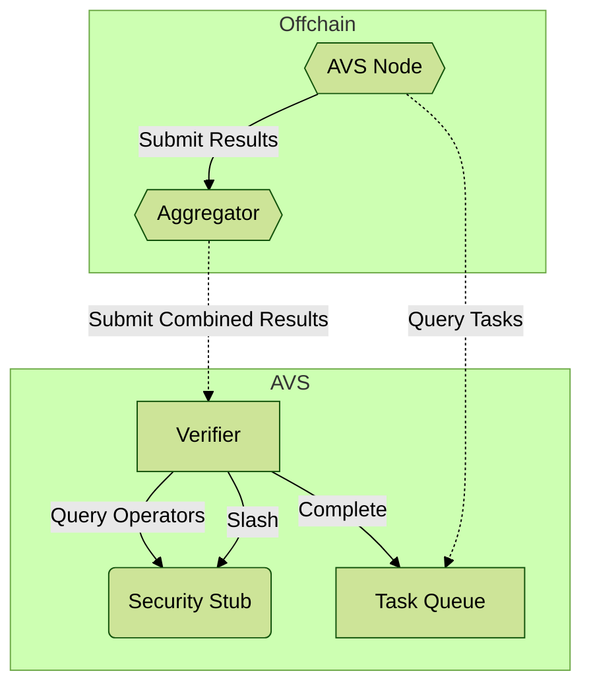

# AVS Toolkit

This repository includes all dependencies needed to build an AVS on layer.
This includes the CosmWasm contracts that run on the blockchain under consensus,
as well as the WASI components that are run by AVS operators in execute off-chain actions.

The actual blockchain nodes and the WASI runner are in separate repositories, but can often
just be reference via URLs as hosted services. This repository should include everything you
need to create and deploy the actual AVS logic itself.

This is a rough diagram of how the on- and off-chain pieces fit together:

Let's break this down:

## AVS Node

A serverside platform powered by [Wasmatic](https://github.com/Lay3rLabs/wasmatic) to run "Actively Validated Services". These services can be non-deterministic, interact with filesystem or network, and do many things not possible on the blockchain. It's all powered by the WebAssembly System Interface.

These services do not run in a vacuum. They need to know about the rest of the Layer ecosystem in order to get triggered and validated, and they also need to know where to store their output or persist any required state.

In the diagram here, the `Task Queue` is used for both the trigger and the output, and there is a security layer preventing the AVS from writing to the Task Queue directly.

## Aggregator (Optional)

An aggregator, may collect, verify, and submit results from many operators. Alternatively, operators may submit results directly to a verifier contract though there is some overhead to this. Aggregators have been used frequently with AVSs in the Eigenlayer ecosystem to get around high Ethereum gas prices.

## Verifier

When the AVS has been triggered and completes its work, it submits this work to the blockchain. However, the results need to go through a security vetting process before they can be trusted. The first step in this process is the Verifier.

In theory, the verifying logic can be anything that fulfills the requirements for a given product. In practice, this logic almost always follows some common scheme:

* Minimum number of submissions from trusted operators
* Results are all identical or close to identical
* Payment threshhold reached

Since these schemes are generic and repeatable, we provide contracts that can be used out of the box such as `simple-verifier` (_TODO: add more, document their features and tradeoffs_)

## Security Stub

One of the pieces of information that the Verifier needs to know is the trusted set of operators. Otherwise, anyone could submit the results from a bunch of addresses and force their desired outcome.

The decision of which operators are trusted or not, and how to incentivize good behavior and punish the bad, is the role of this security system.

See [Commmitments Documentation](https://github.com/Lay3rLabs/commitments/blob/main/docs/RESTAKING.md) for more information

## Triggers 

Each AVS has a specific `Trigger`. Some examples are:

* Task Queue (documented here)
* Events such as reacting to a coin transfer
* Cron-like scheduled processeses

In the future, there may be many more kinds of triggers.

The typical usecase is having an explicit queue where tasks can be added and run by the AVS. That's the purpose of the `Task Queue`. It's an on-chain contract with a well-defined system of identifiers, timeouts, events, and payloads - everything needed to work with the queue from clientside and the AVS. 

In other words, the `Task Queue` is the glue and the lifecycle of a particular task looks roughly like this (putting aside the security layers mentioned above):

1. Client sends an execution message to the Task Queue contract
2. Contract adds it to its internal queue
3. AVS notices that a task is on the queue and ready for processing
4. AVS tries to run the task
5. AVS writes the results to the task queue (by way of the verifier, not directly)
6. Task is now completed and taken off the pending queue (also by way of verifier, not directly).
7. Client can watch out for events all along the lifecycle, or query for a given TaskId state

Each AVS deployment using a Task Queue trigger has a uniquely instantiated contract associated with that deployment. **_For now, this is not enforced by the system - so be very careful to never have different AVS deployments using the same task queue address!_**

## Wasm Interface Types

AVS applications are not _only_ applications - they are defined in tandem with a [WIT file](https://component-model.bytecodealliance.org/design/wit.html) and follow the [WebAssembly Component Model](https://component-model.bytecodealliance.org/introduction.html)

This empowers the composition of services, not by message passing like contracts but rather by direct linking, and also provides for strong typing for any language that knows how to consume WIT files.

## Registry

In the future - all of the above will be tied together via a registry. It will enforce the rules of the system and make it very easy to get started simply by picking from the different parts (Verifier, Trigger, etc.) and import blessed AVS components as building blocks. 