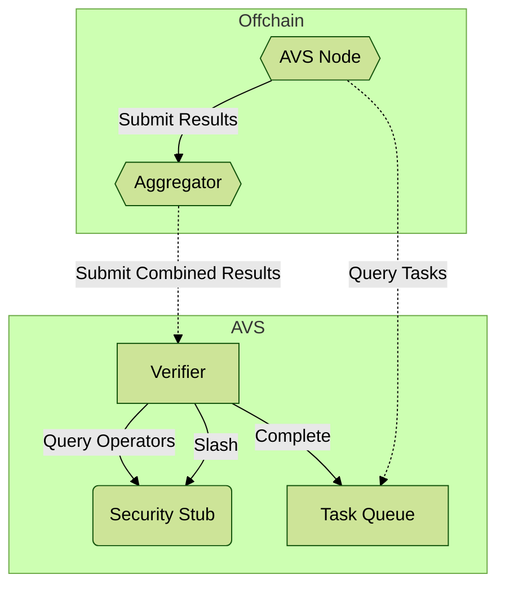

# AVS Toolkit

This repository includes all dependencies needed to build an AVS on layer.
This includes the CosmWasm contracts that run on the blockchain under consensus,
as well as the WASI components that are run by AVS operators in execute off-chain actions.

The actual blockchain nodes and the WASI runner are in separate repositories, but can often
just be reference via URLs as hosted services. This repository should include everything you
need to create and deploy the actual AVS logic itself.

This is a rough diagram of how the on- and off-chain pieces fit together:

